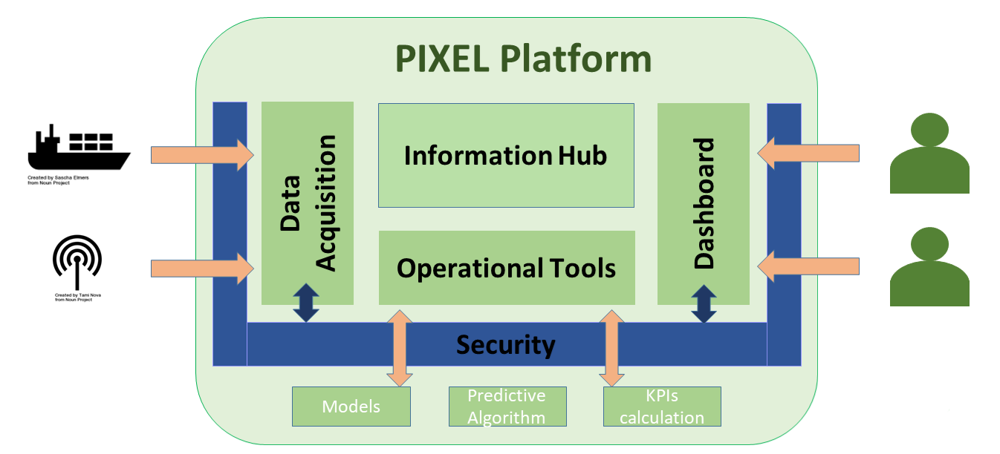
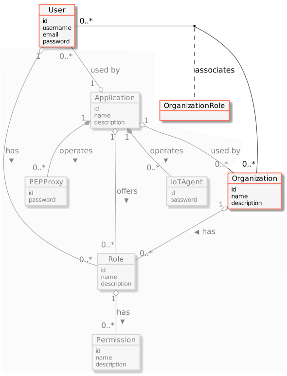

# PIXEL Security Documentation Page 

---

## Overview

This documentation explores in detail the PIXEL Security Layer as one of the main components of the PIXEL architecture. To access the main documentation repository of PIXEL, click [here](https://pixel-ports.readthedocs.io/en/latest/). To access the PIXEL project website, click [here](https://pixel-ports.eu/).

> *PIXEL is the first smart, flexible and scalable solution for reducing environmental impacts while enabling the optimization of operations in port ecosystems through IoT.*

PIXEL enables a two-way collaboration of ports, multimodal transport agents and cities for **optimal use of internal and external resources, sustainable economic growth and environmental impact mitigation, towards the Ports of the Future**. Built on top of the state-of-the art interoperability technologies, PIXEL centralises data from the different information silos where internal and external stakeholders store their operational information. PIXEL leverages an **IoT based communication infrastructure** to voluntarily exchange data among ports and stakeholders to achieve an efficient use of resources in ports.

PIXEL has been financed by the **Horizon 2020 initiative** of the European Commission, contract 769355.  

  

## Main concepts and Architecture

The main function of the security layer is to secure the access to the API of the other components from outside the platform and to provide a solution for identity management.

The security layer secures the access to the NGSI Agents that exposed an API in the Data Acquisition Layer, but it also provides security to the dashboard UI to access the PIXEL’s API (Dashboard, Information Hub and Operational Tools).

We rely on the FIWARE architecture and solution to implement those features in PIXEL, using the FIWARE Generic Enablers:

* KeyRock : The Identity Manager
* Wilma (PEP Proxy) : The OAuth2 proxy that check the access
* AuthzForce : An XACML authorization solution

## (REST) API

Wilma and AuthZForce interact directly with KeyRock to ensure that the access token provided by the user is granted with enough permissions to access the request URI. The PIXEL components have no need to access directly those components.

* AuthZForce provides a [SOAP API](https://github.com/authzforce/rest-api-model/blob/release-5.3.1/src/main/resources/authz-api.wadl)
* Wilma doesn’t provide an API and consumes AuthZForce and Keyrock ones.
 
### Paths
The complete Identity Management API for KeyRock is [fully documented by FIWARE](https://fiware-idm.readthedocs.io/en/latest/) and allows managing all the objects of the Identity Management models:

* Authentication.
* Manage Applications.
* Manage Users.
* Manage Organizations.
* Manage Roles.
* Manage Permissions.
* Manage IoT Agents.
* Manage Pep Proxies.

KeyRock also implements the standard OAuth2 protocol. The different API usages are [documented by FIWARE](https://fiware-idm.readthedocs.io/en/latest/oauth/oauth_documentation/index.html). Those APIs provide all the solution needed to generate a valid X-AuthToken to request an URI access.

In PIXEL most of the tokens are requested using the [Resource Owner Password Credentials Grant](https://fiware-idm.readthedocs.io/en/latest/oauth/oauth_documentation/index.html#resource-owner-password-credentials-grant) method.

### Models
The full API models are implemented in the MySQL Database that helps to show the relation between the different Identity Management objects.
A complete database structure is available on [github](https://github.com/ging/fiware-idm/blob/master/doc/resources/database_structure.png).

The main objects are:

* User: It has credentials, and can be assigned to Organization and Application.
* Organization: It represents a user’s group. It can be assigned to Application.
* Application: We can assign one PEP Proxy to protect a backend. Users and Organizations have assigned Roles in the context of the application.
* Roles: A set of Permissions
* Permission: Defines an allowed request on an Application

